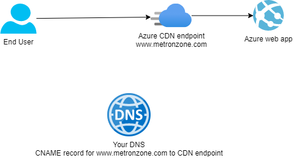
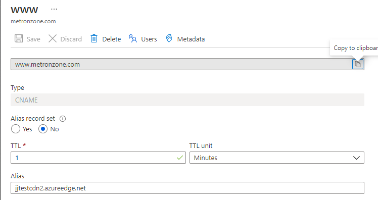
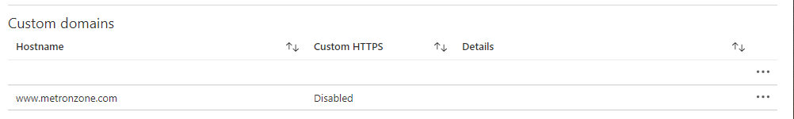
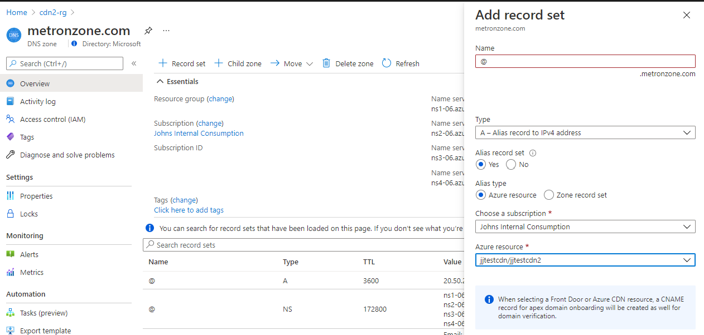
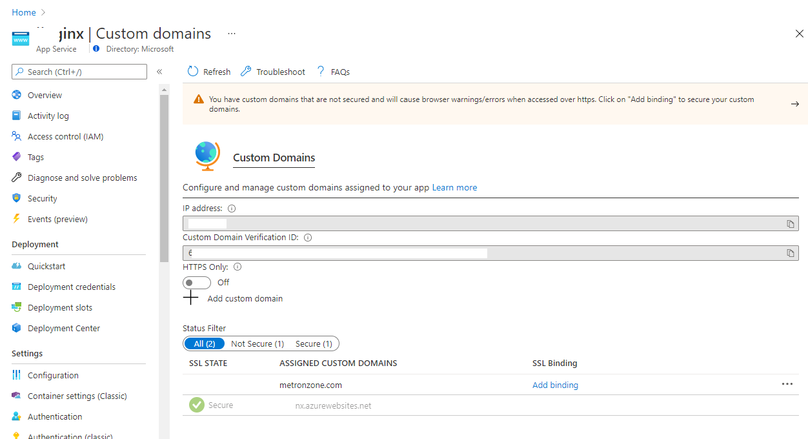
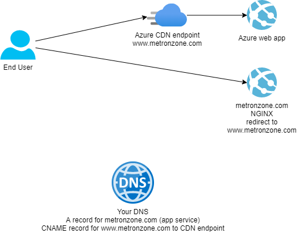
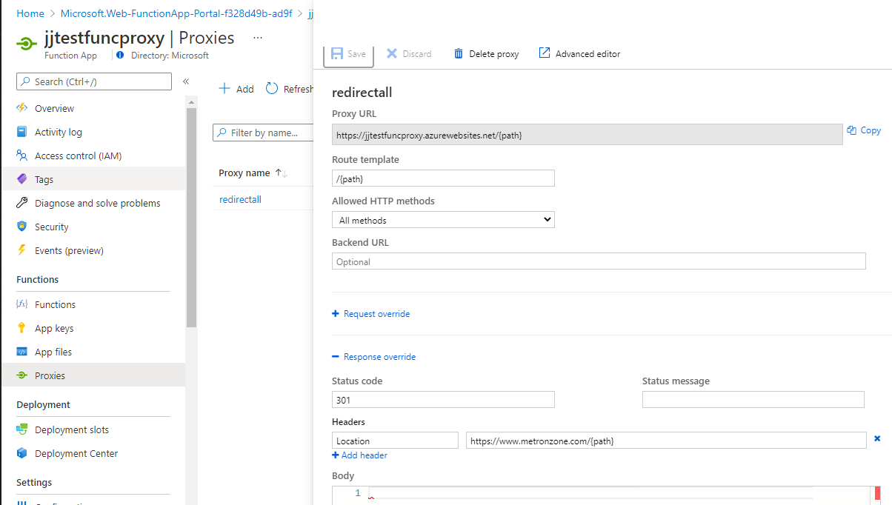

# Apex domains and Azure CDN endpoints

In Azure, platform (PaaS) services provide a higher level of abstraction than infrastructure services. PaaS services allow a customer faster time to market and reduced operational overhead and so are often the first choice for delivering an application or service.

PaaS services usually expose the individual services as fully-qualified domain names (FQDN) under a set of common IP addresses for all users of that service in that location. Azure CDN is one such example. Because the services often share a limited set of IP addresses, these services *must* be accessed via the service FQDN and not their IP address.

Customers often need to use a more friendly domain name and therefore use DNS services to provide a custom domain. CNAME records may be used for this service. So a CNAME record for a custom domain is created which points to the FQDN of the PaaS service. With some configuration at the PaaS service (and generally the registration of an SSL certificate), a service can be quickly delivered against a custom domain name.

## Conventional domains
This works pretty smoothly with a conventional domain. In the example below, a user needs to access a web app which is itself fronted by a CDN. A custom domain name is needed for the domain www.metronzone.com. Your domain's DNS service is configured with a CNAME record which points to the URL of the CDN endpoint and the CDN endpoint is also configured to accept that domaain name.



You create a DNS CNAME pointing to the CDN endpoint


and then make sure your CDN is aware of this DNS name.


## So, what's the problem?
This scheme works well for www.domain.com or app.domain.com, but if the customer wants an *apex domain* (sometimes referred to as root or naked domains) e.g. metronzone.com, then this is where it gets a little more complicated.

The DNS specification does not allow CNAME records for apex domains. See [here](https://www.isc.org/blogs/cname-at-the-apex-of-a-zone/#:~:text=The%20DNS%20record%20type%20CNAME,canonical%20name%20(CNAME)%20RR.) for more. So you cannot set this in your DNS provider. So, some other way must be found.

## Potential solutions
There are some solutions and this problem and the complexity really depends on whether you want to move your DNS provider. I will cover these in turn.

## 1. Move you DNS to an Azure DNS Zone
This is the simplest solution. Azure DNS Zones suport the idea of *alias record sets* - these allow you to point a record (even an apex record *@*) to a specific Azure PaaS resource.


In the above, a DNS *@* apex record is configured to point at an Azure CDN. This can be done for traffic manager, public IP addresses, front door, CDN and static web sites.

This works effectively, but the downside is that changing DNS providers is often a difficult thing to do and many times is a company/organisation wide decision that one application team cannot influence.

## 2. Move to a DNS provider that supports CNAME flattening
This approach is much like the previous one, but it is to use a 3rd-party DNS provider that supports *CNAME flattening* which is explained [here](https://social.dnsmadeeasy.com/blog/how-does-cname-flattening-work/#:~:text=CNAME%20flattening%20allows%20you%20to,to%20that%20in%20a%20minute)

This has the same simplicity upsides as choosing Azure DNS Zones, but also the same downside - if your existing DNS provider does not support this, then it would require a DNS move with all the complexity that involves.

## 3. Use a PaaS service to perform HTTP redirects from the apex domain to wwww.domain
Azure App Services allow you to set a custom domain and this can also be an apex domain.

As you can see above, this app service (in combination with your DNS provider) allows you to set an apex domain for your app service. 

So, how does this help if my app needs Azure CDN infront and the apex domain for this?

What this app service can do is perform a redirect from *metronzone.com* to *www.metronzone.com* (which the CDN can easily be set to using a CNAME record). In this way, any requests to metronzone.com will be redirected by the app service to wwww.metronzone.com - which is CNAMEed to the CDN endpoint.

A diagram below represents the flows:



There are a few potential approaches to how the app service redirects. These could be:
* Install [NGINX](https://www.nginx.com/) in the web app and set a rewrite rule
* provision a function app and write a function proxy
* Potentially write some ASP.NET to perform a redirect (not covered here)

### NGINX approach
NGINX is one of the best know proxy products. 

set *nginx.conf* to:

```
server {
    
    if ($host = metronzone.com) {
        return 301 http://www.metronzone.com$request_uri;
    } 

}
```
NGINX is easily packaged as a Docker container and this loaded into Web App for Containers (a flavour of Azure App Services). There are probably numerous github repos that show how to build customised NGINX containers.

### Function Proxy
Azure functions uses the same underlying runtime as app services, so can benefit from app services' ability to use an apex domain.

In addition, functions have a proxy capability which may be used to redirect requests in similar manner to that of NGINX.

Below is a test proxy in an Azure function which redirect all inbound requests to another URL:



As can be seen from above, the whole path of the URL inbound to this proxy is redirected to the https://www.metronzone.com.

In order for this to work completely, the domain would also need to be set alongside the installation of an SSL certificate for that domain.


# Summary
The inherent difficulty with PaaS services and apex domains can be side-stepped by using an app service or function which is configured for the apex domain, which can then redirect all traffic to a more normal (non-apex) domain. This solution should be cost effective as the proxy is PaaS and can be either serverless or on a low tier app service plan. 

